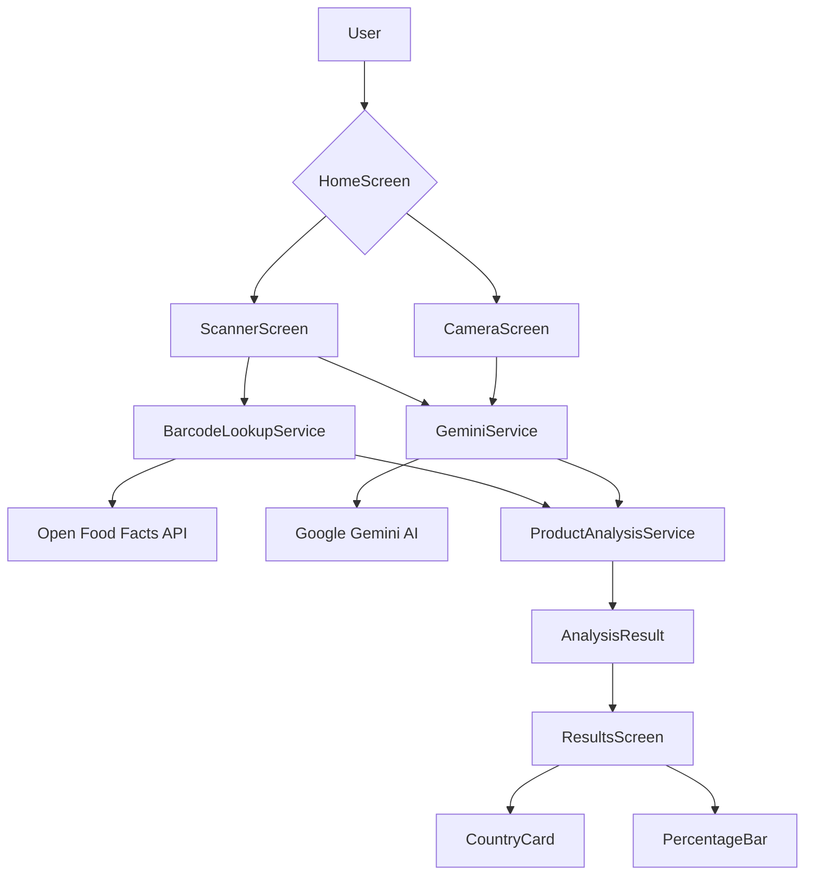
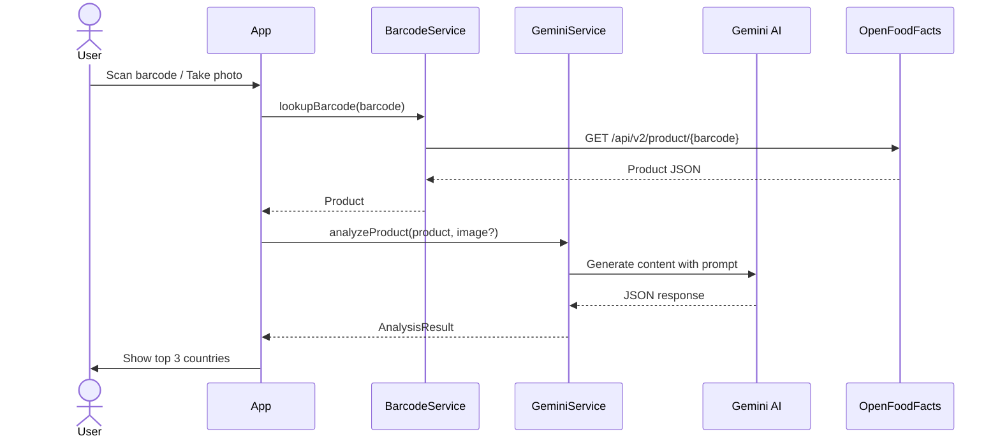

# Code Walkthrough - Goods Scanner

This document explains how every part of the code works together.

## Architecture Overview



## Data Flow



## Key Files Explained

### Models (`lib/models/`)

The data layer. Two classes:

- **`Product`**: Holds barcode, name, brand, category, ingredient sources, manufacturer country. Parsed from Open Food Facts JSON via `fromJson()`.
- **`CountryInvolvement`**: A single country with name, percentage, and role (e.g., "Manufacturing", "Design").
- **`AnalysisResult`**: Wraps the Product + list of CountryInvolvement + summary + benefiting country.

### Services (`lib/services/`)

The business logic layer. Three classes:

1. **`BarcodeLookupService`** — Talks to Open Food Facts API. Returns a `Product` from a barcode string. Free, no auth needed.

2. **`GeminiService`** — Talks to Google Gemini 3.5 Flash. Builds a prompt with product details and/or an image. The prompt instructs Gemini to return a strict JSON format with country percentages. Parses the response into `AnalysisResult`.

3. **`ProductAnalysisService`** — Orchestrator. Has three methods depending on what the user provided:
   - `analyzeByBarcode(barcode)` — Looks up product then sends to Gemini
   - `analyzeByImage(imageFile)` — Sends just the image to Gemini (photo-only)
   - `analyzeByBarcodeAndImage(barcode, imageFile)` — Both (richest analysis)

### Screens (`lib/screens/`)

The UI layer. Four screens:

1. **`HomeScreen`** — Two large buttons: "Scan Barcode" and "Take Photo". Entry point.

2. **`ScannerScreen`** — Full-screen camera feed from `mobile_scanner`. When a barcode is detected, navigates to `ResultsScreen` with the barcode string.

3. **`CameraScreen`** — Uses the `camera` package. User taps to take a photo, then navigates to `ResultsScreen` with the image file.

4. **`ResultsScreen`** — Takes either a barcode or an image file. Calls `ProductAnalysisService`, shows loading state while waiting, then displays:
   - Product name/brand
   - Country cards (flag placeholder + name + percentage + role)
   - Benefiting country highlight box
   - Analysis summary

### Widgets (`lib/widgets/`)

Reusable UI components:

1. **`CountryCard`** — Card with country name, percentage, role text, and a percentage bar.

2. **`PercentageBar`** — Colored progress bar (green ≥50%, orange ≥25%, blue <25%).

3. **`LoadingOverlay`** — Centered spinner with "Analyzing product..." message.

### Config (`lib/config/env.dart`)

Loads the Gemini API key from `.env` using `flutter_dotenv`. Throws a clear error if the key is missing.

## How the AI Prompt Works

The magic is in `GeminiService._buildPrompt()`. It constructs a prompt that:

1. Tells Gemini it's a "global supply chain analyst"
2. Provides the product details (name, brand, category, manufacturer country)
3. Includes the product image (if provided)
4. Instructs Gemini to return **only** a JSON object with:
   - `countries` — array of `{country, percentage, role}`
   - `summary` — brief explanation
   - `benefiting_country` — where profit flows

The response is parsed in `_parseResponse()`, with a fallback if JSON parsing fails.

## Error Handling

Each layer handles failures:

- **BarcodeLookupService**: Returns `null` on network/parse errors → Gemini still analyzes what it has
- **GeminiService**: Returns a fallback `AnalysisResult` with "Unknown" if AI fails
- **ResultsScreen**: Shows an error state with a "Retry" button
- **Env**: Throws at startup if the Gemini API key is missing

## Building the APK

```bash
flutter build apk --debug
```

Output: `build/app/outputs/flutter-apk/app-debug.apk`

## Testing

```bash
flutter test
```

The test file at `test/widget_test.dart` can be expanded with unit tests for services and widget tests for screens.
